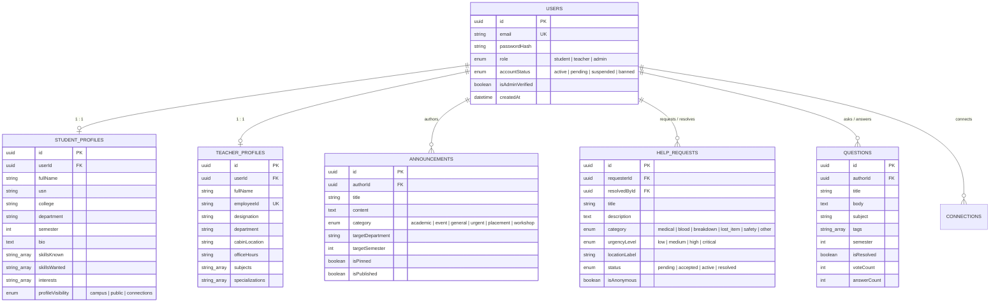
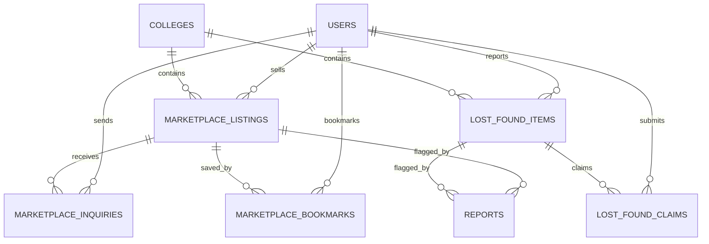

# UniLink System Architecture & Engineering Specifications

UniLink is an enterprise-grade digital campus ecosystem engineered for colleges and universities to connect **Students**, **Teachers**, and **Administrators** into a unified collaborative environment.

The core philosophy revolves around:
**Learn + Connect + Collaborate + Participate + Help**

---

## 1. System Architecture Diagram

```mermaid
graph TD
    subgraph ClientLayer["Frontend Client (React 19 + Vite)"]
        UI[UniLink SPA]
        SPortal[Student Portal]
        TPortal[Teacher Portal]
        APortal[Admin Portal]
        AuthStore[Zustand Auth Store + LocalStorage]
        AxiosClient[Axios API Client + Auto Refresh Interceptor]
        UI --> SPortal
        UI --> TPortal
        UI --> APortal
        SPortal --> AuthStore
        TPortal --> AuthStore
        APortal --> AuthStore
        SPortal --> AxiosClient
        TPortal --> AxiosClient
        APortal --> AxiosClient
    end

    subgraph APILayer["Backend Gateway (Express.js)"]
        Router[Express Router]
        AuthMW[authenticate Middleware (JWT Bearer)]
        RoleMW[authorize Role Guard (RBAC)]
        RateLimiter[express-rate-limit]
        HelmetSec[Helmet & CORS Security]

        AxiosClient -->|REST API Requests| RateLimiter
        RateLimiter --> HelmetSec
        HelmetSec --> Router
        Router --> AuthMW
        AuthMW --> RoleMW
    end

    subgraph ServiceLayer["Domain Controllers & Routes"]
        AuthRoute["/api/auth (Login, Register, Refresh)"]
        StudentRoute["/api/student (Profile, Skills, Q&A, Peers, SOS)"]
        TeacherRoute["/api/teacher (Announcements, Resources, Guidance)"]
        AdminRoute["/api/admin (User Moderation, Verification, Analytics)"]

        RoleMW --> AuthRoute
        RoleMW --> StudentRoute
        RoleMW --> TeacherRoute
        RoleMW --> AdminRoute
    end

    subgraph DataLayer["Persistence & Infrastructure"]
        SequelizeORM[Sequelize ORM]
        PostgresDB[(PostgreSQL Database)]
        FirebaseFCM[Firebase Admin Cloud Messaging]

        StudentRoute --> SequelizeORM
        TeacherRoute --> SequelizeORM
        AdminRoute --> SequelizeORM
        AuthRoute --> SequelizeORM
        SequelizeORM --> PostgresDB
        StudentRoute -.->|Emergency SOS Alerts| FirebaseFCM
        TeacherRoute -.->|Campus Notifications| FirebaseFCM
    end
```

---

## 2. Entity-Relationship Data Model



---

## 3. Role-Based Access Control Matrix

| Role | Access Permissions | Restricted Boundaries |
| :--- | :--- | :--- |
| **Student** | Browse skill matches, swap skills, ask/answer peer questions, join study groups, assemble hackathon teams, raise SOS alerts, browse peer directory, send direct messages. | Cannot verify faculty, access admin metrics, or post official college circulars without faculty verification. |
| **Teacher** | Separate faculty portal, publish department/course announcements, share verified course study materials, answer student questions with verified faculty authority, review mentorship requests. | Cannot modify system-wide user credentials or access campus-wide administrative moderation actions. |
| **Admin** | Full system administration, verify/approve faculty onboarding registrations, suspend/reactivate/ban malicious accounts, access live database audit telemetry, broadcast campus emergencies. | Restricted to governance & administrative supervision. |

---

## 4. Emergency SOS Dispatch & Proximity Workflow

1. **Trigger**: A student experiencing medical distress, vehicle breakdown, or safety concern initiates a help ticket with an urgency rating (`critical`, `high`, `medium`, `low`) and designated campus zone.
2. **Notification Broadcast**: The server assigns a ticket ID, anonymizes personal identifiers if opted, and dispatches real-time broadcast alerts to campus security and nearby volunteers.
3. **Volunteer Acceptance**: Peers within proximity can tap **"I Can Help"**, which marks the state to `accepted`, displays contact coordinates, and notifies the requester.
4. **Resolution & Karma Credit**: Upon resolving the incident, the ticket is marked `resolved` with a timestamp, rewarding the helper with campus contribution karma points.

---

## 5. Events & Campus Activities Architecture

### 5.1 Architecture & Multi-College Isolation
Campus activities are scoped strictly to individual institutions (`colleges.id`). Events can target the entire institution (`COLLEGE`), specific academic departments (`DEPARTMENT`), or individual cohorts (`SEMESTER`). Cross-college discovery and registrations are forbidden at the database and service layer (`403 Forbidden`).

### 5.2 Event Lifecycle State Machine
```
   ┌─────────┐       publish       ┌───────────┐      ongoing / end date     ┌───────────┐
   │  DRAFT  ├────────────────────►│ PUBLISHED ├────────────────────────────►│ COMPLETED │
   └────┬────┘                     └─────┬─────┘                             └───────────┘
        │ cancel                         │ cancel
        └──────────────┐   ┌─────────────┘
                       ▼   ▼
                 ┌───────────┐
                 │ CANCELLED │
                 └───────────┘
```
- **DRAFT**: Organizer is preparing the event agenda and registration dates. Visible only to the creating faculty/admin.
- **PUBLISHED**: Open for student discovery, bookmarking, and registration.
- **ONGOING / COMPLETED**: Active during scheduled event window; terminal state once past `endDateTime`.
- **CANCELLED**: Terminal cancellation state with recorded administrative reason; automatically sends in-app cancellation notifications to all registered students.

### 5.3 Registration & Waitlist Queue Architecture
- **Single Active Registration**: A student cannot register twice (`409 Conflict`). Unique composite constraint on `(eventId, studentId)`.
- **Automatic Waitlisting**: When active capacity reaches `maxParticipants`, subsequent applicants receive `WAITLISTED` status.
- **Automatic Promotion**: When a registered student cancels their seat, the oldest waitlisted student (`ORDER BY registeredAt ASC`) is instantly promoted to `REGISTERED`, updating the capacity counter and triggering an in-app promotion alert (`WAITLIST_PROMOTED`).

### 5.4 Attendance Flow & Reputation Integration
- Authorized faculty organizers or administrators can review the attendee roster and mark attendance (`ATTENDED` / `NO_SHOW`).
- Students cannot mark themselves attended.
- Verified event attendance rewards the student with **+10 Karma Reputation Points** recorded in `reputation_logs` and increments `StudentProfile.reputationScore`.

### 5.5 Security & IDOR Prevention
- Teachers can only edit, publish, cancel, or manage attendance for events where `event.createdBy === user.id`.
- Attempts by other faculty members to alter attendance or event details are rejected (`403 Forbidden`).
- Sensitive administrative operations generate persistent audit trail logs (`AuditLog`).

---

## 6. Resource Vault & Academic Repository Architecture

### 6.1 Architecture & Multi-College Isolation
Academic learning materials belong strictly to their parent college (`resources.college_id`). Every resource tracks structured academic metadata:
- **Discipline & Target**: Department / Branch (`departmentId`), Semester (`semester` 1–10), Academic Year (`academicYear`), University affiliation.
- **Resource Categorization**: 11 distinct academic types (`NOTES`, `STUDY_MATERIAL`, `PYQ`, `LAB_MANUAL`, `LAB_PROGRAM`, `ASSIGNMENT`, `QUESTION_BANK`, `SYLLABUS`, `PRESENTATION`, `REFERENCE`, `EBOOK`, `OTHER`).
- Cross-college discovery and access are strictly prohibited (`403 Forbidden`).

### 6.2 Resource Review & Lifecycle State Machine
```
   ┌─────────┐      submit       ┌────────────────┐     admin approve     ┌───────────┐
   │  DRAFT  ├──────────────────►│ PENDING_REVIEW ├──────────────────────►│ PUBLISHED │
   └────┬────┘                   └───────┬────────┘                       └─────┬─────┘
        │                                │ admin reject                         │ archive
        │                                ▼                                      ▼
        │                         ┌────────────┐                         ┌───────────┐
        │                         │  REJECTED  │                         │  ARCHIVED │
        │                         └────────────┘                         └───────────┘
        │ delete (draft owner / admin)
        ▼
   [ DELETED ]
```
- **DRAFT**: Faculty preparing materials. Hidden from student discovery.
- **PENDING_REVIEW**: Submitted for administrative quality assurance and syllabus alignment.
- **PUBLISHED**: Live in the repository for eligible students to discover, view, download, and bookmark.
- **REJECTED**: Administrator flagged with a required `moderationReason`; uploader receives in-app notification and can edit & resubmit.
- **ARCHIVED**: Deprecated or legacy semester resources retained for audit but hidden from discovery.

### 6.3 Storage Service Abstraction & File Security
- **Decoupled Provider**: Business logic interacts with `storageService`, which defaults to `LocalStorageProvider` (`/uploads/resources/`) and is pluggable for AWS S3, Cloudinary, and Firebase Storage without modifying resource handlers.
- **Strict Format Whitelisting**: Allows only verified academic formats (`.pdf`, `.doc`, `.docx`, `.ppt`, `.pptx`, `.xls`, `.xlsx`, `.txt`, `.jpg`, `.jpeg`, `.png`).
- **Executable Blacklist**: Explicit rejection of `.exe`, `.sh`, `.bat`, `.cmd`, `.js`, `.php`, `.py`, `.html`, etc.
- **Path Traversal Prevention**: Strips `..`, `/`, `\`, and special characters from filenames; enforces that physical paths remain rooted inside the designated base directory.
- **Configurable Limits**: Default 25MB maximum per upload (`MAX_RESOURCE_FILE_SIZE_MB`).

### 6.4 Student Access Control & Targeting
- **Status Guard**: Students can only access `PUBLISHED` resources. Drafts, pending reviews, and archives return `403 Forbidden`.
- **Targeting Enforcement**:
  - `COLLEGE`: Open to all verified students of the college.
  - `DEPARTMENT`: Validated server-side against student's enrolled department (`studentProfile.departmentId`).
  - `SEMESTER`: Validated server-side against student's active semester (`studentProfile.semester`).
  - `PRIVATE`: Restricted exclusively to uploader and college administrators.

### 6.5 Bookmark System
- Student-specific bookmarks persisted in `resource_bookmarks` table.
- Enforces unique composite key `(resourceId, studentId)` to prevent duplicate saves (`409 Conflict`).
- Paginated retrieval via `GET /api/resources/saved`.

### 6.6 View & Download Telemetry with Anti-Abuse Debouncing
- View and download counters incremented via database atomic updates.
- In-memory 60-second view and 30-second download debouncing prevents rapid counter inflation by repeated clicks.
- Secure downloads via `GET /api/resources/:id/download` with authorization verification.

### 6.7 Moderation, Reporting & Audit Logging
- **Reporting System**: Students can report inaccurate or copyrighted materials with designated categories (`Incorrect content`, `Copyright concern`, `Wrong subject`, `Duplicate`, etc.). Stored in `Report` model (`resourceId`).
- **Audit Logs**: All administrative actions (approve, reject with mandatory reason, archive, delete) generate immutable `AuditLog` records for institutional compliance.

---

## 7. Alumni Networking & Mentorship Engine Architecture

### 7.1 Product Purpose & Identity Model
The Alumni Networking & Mentorship Engine bridges current undergraduate students with verified former graduates from their own institution. The engine enables career guidance, interview preparation, resume reviews, technical mentorship, and domain exploration.

```
CURRENT STUDENT ──► DISCOVER VERIFIED ALUMNI ──► REQUEST MENTORSHIP ──► ALUMNI ACCEPTS ──► ACTIVE MENTORSHIP ──► SESSIONS / PRIVATE CHAT ──► COMPLETED ──► FEEDBACK & REPUTATION
```

- **Identity Reuse**: Built on the unified `User` model rather than a disjoint auth system. Former students attach an `AlumniProfile` (1:1 with `User`).
- **Role Integration**: Backward-compatible RBAC supports `student` users with alumni credentials, or dedicated `alumni` role without teacher/admin privileges.
- **Privacy & Data Masking**: Personal emails, phones, and addresses are strictly shielded. Public profiles expose verified badges, graduation year, degree, current company, title, industry, experience, skills, and mentorship topics.

### 7.2 Alumni Verification Workflow
To prevent fraudulent mentor claims, all alumni profiles require administrative verification before appearing in discovery:
```
Alumni Submits Profile ──► PENDING ──► Admin Review ──► APPROVED (VERIFIED)
                                                   └──► REJECTED (Reason Required)
                                                   └──► SUSPENDED (Immediate Discovery Removal)
```
- **Verification States**: `PENDING`, `VERIFIED`, `REJECTED`, `SUSPENDED`.
- **Admin Review Queue**: Accessible at `/admin/alumni`. Administrators can approve (1-click) or reject (requires mandatory rationale).
- **Audit Compliance**: All verification decisions generate immutable `AuditLog` entries (`ALUMNI_VERIFIED`, `ALUMNI_REJECTED`, `ALUMNI_SUSPENDED`).
- **Immediate Enforcement**: Suspended alumni are instantly excluded from student discovery, search, new mentorship requests, and messaging.

### 7.3 Mentorship Lifecycle & State Machine
Mentorship requests follow a strictly validated server-side state machine:
```
           ┌───────────┐      Alumni Accepts      ┌────────────┐      Start      ┌──────────┐      Complete      ┌───────────┐
           │  PENDING  ├─────────────────────────►│  ACCEPTED  ├────────────────►│  ACTIVE  ├──────────────────►│ COMPLETED │
           └───┬───┬───┘                          └────────────┘                 └──────────┘                    └─────┬─────┘
               │   │                                                                                                   │
Alumni Decline │   │ Student Cancels                                                                                   │
               ▼   ▼                                                                                                   ▼
       ┌───────────┬───────────┐                                                                               ┌───────────────┐
       │ DECLINED  │ CANCELLED │                                                                               │ 1-5★ FEEDBACK │
       └───────────┴───────────┘                                                                               └───────────────┘
```
- **State Transition Rules**:
  - `PENDING` -> `ACCEPTED` (only by requested alumnus)
  - `PENDING` -> `DECLINED` (only by requested alumnus, with optional rationale)
  - `PENDING` -> `CANCELLED` (only by requesting student)
  - `ACCEPTED` -> `ACTIVE`
  - `ACTIVE` -> `COMPLETED` (by either participant)
  - `COMPLETED -> ACTIVE` or any modification to completed mentorship is rejected (`400 Bad Request`).
- **Single Active Request Constraint**: Only one active or pending request is permitted between the same student and alumni (`409 Conflict`).
- **College Isolation**: Both parties must belong to the same college (`403 Forbidden` on cross-college attempts).
- **Block Protection**: If either party has blocked the other, mentorship requests and messaging are blocked (`403 Forbidden`).

### 7.4 Mentorship Sessions Architecture
- **Lightweight Scheduler**: Stored in `mentorship_sessions` table, associated with `mentorshipRequestId`.
- **Session Attributes**: Date & time (`scheduledAt`), duration (`durationMinutes`), mode (`CHAT`, `VIDEO`, `PHONE`), external meeting link (`meetingLink`), and agenda notes (`notes`).
- **Session Lifecycle**: `SCHEDULED`, `COMPLETED`, `CANCELLED`, `NO_SHOW`.
- **Authorization**: Only participants in an `ACCEPTED` or `ACTIVE` mentorship can schedule or modify sessions.

### 7.5 Private Mentorship Messaging
- **Dedicated Communication Channel**: Stored in `mentorship_messages` table.
- **Strict Privacy**: Visible only to the student and the mentor of the specific mentorship relationship. Teachers and students from other departments cannot view or access the message feed.
- **Blocked Check**: Mutual blocking check is enforced prior to creating any message.

### 7.6 Deterministic Compatibility & Match Scoring
The service calculates a deterministic compatibility score (0–100%) for each alumnus relative to the viewing student without requiring external AI APIs:
1. **Department Alignment** (+25%): Same department / branch between student and alumnus.
2. **Skill Overlap** (+25%): Student's known or wanted skills matching alumnus skill tags (1 match = 15%, 2+ matches = 25%).
3. **Mentorship Topic Match** (+30%): Overlap between student learning goals and alumnus mentorship topics (1 match = 20%, 2+ matches = 30%).
4. **Availability Status** (+10%): `AVAILABLE` (+10%), `LIMITED` (+5%), `NOT_AVAILABLE` (0%).
5. **Industry Experience** (+10%): >= 5 years (+10%), >= 2 years (+7%), >= 1 year (+5%).

### 7.7 Feedback & Reputation Integration
- **Post-Completion Only**: Feedback is permitted strictly after the mentorship status transitions to `COMPLETED`. Pre-completion attempts return `400 Bad Request`.
- **Anti-Duplication**: Exactly one feedback per participant per mentorship (`mentorship_feedbacks` unique key `[mentorshipRequestId, reviewerId]`).
- **Reputation Award**: Submitting feedback generates a `ReputationLog` entry awarding **+15 Karma points** to the mentor, atomically updating their profile reputation score.
- **Average Rating Calculation**: Updates `AlumniProfile.averageRating` and `AlumniProfile.feedbackCount`.

### 7.8 Bookmarks & Directory Telemetry
- **Alumni Bookmarks**: Students can bookmark alumni profiles (`alumni_bookmarks` table with composite unique constraint `[studentId, alumniProfileId]`).
- **Server-Side Pagination & Database Filtering**: Search by name, company, title, industry, department, and topic execute at database level with indexed queries. Full directory is never loaded into memory.

---

## 8. Campus Placement & Internship Portal (TPC) Architecture

### 8.1 Overview & System Purpose
The Campus Placement & Internship Portal turns UniLink into a career ecosystem for verified students and authorized Training & Placement Cell (TPC) staff. It bridges academic standing (department, semester, graduation year, CGPA, backlogs, skills) with career opportunities (full-time roles, internships, campus drives).

### 8.2 Database Models & Entity-Relationship Model
- **`Company`**: College-isolated employer registry (`name`, `logo`, `website`, `industry`, `verificationStatus`: `PENDING`, `VERIFIED`, `REJECTED`, `verifiedById`).
- **`Opportunity`**: Career listings & campus recruitment drives (`collegeId`, `createdBy`, `companyId`, `companyName`, `title`, `description`, `opportunityType`: `INTERNSHIP`, `FULL_TIME`, `CAMPUS_DRIVE`, etc., `workMode`: `ONSITE`, `REMOTE`, `HYBRID`, `stipend`, `salaryMin`, `salaryMax`, `applicationDeadline`, `driveDate`, `venue`, `eligibility`: JSON, `status`: `DRAFT`, `PUBLISHED`, `APPLICATION_CLOSED`, `CANCELLED`).
- **`OpportunityApplication`**: Student job submissions (`opportunityId`, `studentId`, `collegeId`, `status`, `currentStage`, `eligibilitySnapshot`, `resumeUrl`, `resumeFilename`, `coverLetter`). Unique constraint on `[opportunityId, studentId]`.
- **`OpportunityBookmark`**: Saved job listings (`opportunityId`, `studentId`). Unique constraint on `[opportunityId, studentId]`.
- **`PlacementInterview`**: Recruitment rounds, coding tests, and interviews (`applicationId`, `opportunityId`, `studentId`, `type`: `ONLINE_TEST`, `OFFLINE_TEST`, `TECHNICAL_INTERVIEW`, `HR_INTERVIEW`, `GROUP_DISCUSSION`, `scheduledAt`, `venue`, `meetingLink`, `status`: `SCHEDULED`, `COMPLETED`, `result`: `PENDING`, `PASSED`, `FAILED`).
- **`PlacementProfile`**: Extended student career profile (`userId`, `collegeId`, `cgpa`, `activeBacklogs`, `totalBacklogs`, `graduationYear`, `preferredRoles`, `preferredLocations`, `preferredWorkMode`, `resumeUrl`, `resumeFilename`, `placedStatus`: `NOT_PLACED`, `PLACED`, `OPTED_OUT`).

### 8.3 Server-Side Eligibility Engine
Eligibility is evaluated dynamically on the server:
```
Eligibility Criteria:
├── Eligible Departments: Compared against student department code or title
├── Eligible Semesters: Compared against student current semester
├── Graduation Years: Compared against placementProfile.graduationYear
├── Minimum CGPA: Requires studentProfile.cgpa >= opportunity.minimumCgpa
├── Maximum Active Backlogs: Ensures active backlogs <= opportunity.maxActiveBacklogs
├── Maximum Total Backlogs: Ensures total historic backlogs <= opportunity.maxTotalBacklogs
└── Required Skills: Case-insensitive set intersection against student known skills
```
- Ineligible students receive HTTP 400 with a detailed `missingCriteria` array explaining exact deficiencies.

### 8.4 Application Recruitment State Machine
Strict state machine enforced on all transitions:
```
[APPLIED] ───► [UNDER_REVIEW] ───► [SHORTLISTED] ───► [TEST] ───► [INTERVIEW] ───► [SELECTED] ───► [OFFER_ACCEPTED]
   │                 │                    │             │            │                │                 ▲
   │                 │                    │             │            │                └──► [OFFER_DECLINED]
   ▼                 ▼                    ▼             ▼            ▼
[WITHDRAWN]     [WITHDRAWN]          [REJECTED]     [REJECTED]   [REJECTED]
```
- **Permission Matrix**:
  - Students can only transition `APPLIED`/`UNDER_REVIEW` -> `WITHDRAWN`, and `SELECTED` -> `OFFER_ACCEPTED`/`OFFER_DECLINED`.
  - Authorized TPC/Admin staff manage recruitment stages (`UNDER_REVIEW`, `SHORTLISTED`, `TEST`, `INTERVIEW`, `SELECTED`, `REJECTED`).
  - Invalid transitions are rejected with HTTP 400 Bad Request.

### 8.5 Resume Privacy & IDOR Protection
- Resumes are stored privately in `/uploads/resumes/` and are never exposed via unauthenticated static file servers.
- Downloads are served exclusively through `/api/placements/resumes/:filename` with strict RBAC:
  - Allowed for the student owner of the resume.
  - Allowed for authorized TPC administrators within the same college.
  - Blocked with HTTP 403 Forbidden for unauthorized students or cross-college staff.
- File integrity: Whitelisted extensions (`.pdf`, `.doc`, `.docx`), blacklisted executables, MIME type verification, and anti-path-traversal sanitization.

### 8.6 Placement Telemetry & Analytics
- Executive metrics: Total opportunities, active drives, total applicants, shortlisted count, interviews count, offers accepted, and aggregate placement conversion rate.
- Department-wise breakdown: Applications and selections per engineering department.
- Company-wise breakdown: Hired student count per employer.

---

## 9. Campus Clubs, Student Chapters & Societies Architecture

### 9.1 Overview & System Purpose
The Clubs & Societies module organizes campus life, professional student chapters (IEEE, ACM, GDSC), technical societies (Coding, Robotics, AI/ML), cultural clubs, sports teams, and department associations into an institution-isolated, governance-backed digital platform.

### 9.2 Database Models & Entity Schema
- **`Club`**: Institutional club profile (`collegeId`, `departmentId`, `name`, `shortName`, `description`, `category`: `TECHNICAL`, `PROFESSIONAL`, `CULTURAL`, `SPORTS`, `ACADEMIC`, `SOCIAL_SERVICE`, `ENTREPRENEURSHIP`, `HOBBY`, `DEPARTMENT`, `OTHER`, `logo`, `coverImage`, `foundedYear`, `facultyAdvisorId`, `contactEmail`, `contactPhone`, `meetingLocation`, `meetingSchedule`, `website`, `socialLinks`, `status`: `DRAFT`, `PENDING_REVIEW`, `ACTIVE`, `SUSPENDED`, `ARCHIVED`, `membershipApprovalRequired`, `electionsEnabled`, `createdBy`).
- **`ClubMembership`**: Student membership records (`clubId`, `studentId`, `status`: `PENDING`, `ACTIVE`, `REJECTED`, `SUSPENDED`, `LEFT`, `role`: `MEMBER`, `OFFICER`, `SECRETARY`, `TREASURER`, `VICE_PRESIDENT`, `PRESIDENT`, `joinedAt`, `approvedAt`, `approvedBy`, `leftAt`, `isCurrent`). Composite unique index on `(clubId, studentId)`.
- **`ClubOfficer`**: Formal leadership appointment records (`clubId`, `studentId`, `position`, `startDate`, `endDate`, `appointedBy`, `status`).
- **`ClubAnnouncement`**: Club broadcasts and bulletins (`clubId`, `authorId`, `title`, `content`, `pinned`, `publishedAt`, `status`).
- **`ClubActivity`**: Internal workshops, practice sessions, project sprints (`clubId`, `createdBy`, `title`, `description`, `activityType`: `MEETING`, `WORKSHOP`, `COMPETITION`, `PROJECT`, `OUTREACH`, `PRACTICE`, `OTHER`, `location`, `startAt`, `endAt`, `capacity`, `registrationRequired`, `visibility`: `CLUB_ONLY`, `COLLEGE`, `status`).
- **`ClubElection`**: Democratic leadership election cycles (`clubId`, `createdBy`, `title`, `description`, `startAt`, `endAt`, `status`: `DRAFT`, `UPCOMING`, `OPEN`, `CLOSED`, `CANCELLED`, `RESULTS_PUBLISHED`, `eligibleMembershipRule`).
- **`ClubElectionPosition`**: Contested seats in an election (`electionId`, `title`, `maxWinners`, `description`).
- **`ClubCandidate`**: Approved or pending member nominees (`electionPositionId`, `studentId`, `manifesto`, `approved`, `approvedBy`).
- **`ClubVote`**: Anonymous, single-cast ballots (`electionId`, `positionId`, `voterStudentId`, `candidateId`). Composite unique constraint on `(electionId, positionId, voterStudentId)`.

### 9.3 Club Creation & Governance Workflow
```
[STUDENT] Proposes Club ──► [PENDING_REVIEW] ──► [ADMIN REVIEWS]
                                                     │
                             ┌───────────────────────┴───────────────────────┐
                             ▼                                               ▼
                         [ACTIVE]                                        [ARCHIVED / REJECTED]
                    Founder ──► PRESIDENT                           With Mandatory Reason Logged
```
- Students cannot self-activate proposals. Unapproved clubs are excluded from public catalog queries.
- Admin approval automatically transitions the creator to `ACTIVE` with role `PRESIDENT`.
- All moderation actions (approve, reject, suspend, archive) record immutable `AuditLog` events.

### 9.4 Membership State Machine & Roles
- **Application**: Student clicks Join -> if `membershipApprovalRequired === true`, state is `PENDING`; otherwise, state is immediately `ACTIVE`.
- **Duplicate Prevention**: Database and application level checks prevent multiple active or pending applications for the same club.
- **Leadership Control**: President/VP/Admin can approve or reject pending requests.
- **Departure**: Students can leave at any time or cancel pending applications (transitions to `LEFT`).
- **Suspension**: Club leadership or admin can suspend problematic members (transitions to `SUSPENDED`).

### 9.5 Role Hierarchy & Authorization Matrix
```
             ┌───────────────┐
             │     ADMIN     │ (Full platform moderation across college)
             └───────┬───────┘
                     │
             ┌───────▼───────┐
             │   PRESIDENT   │ (Settings, Appoint Officers, Approve Members, Elections)
             └───────┬───────┘
                     │
             ┌───────▼───────┐
             │ VICE PRESIDENT│ (Announcements, Activities, Candidate Approval)
             └───────┬───────┘
                     │
             ┌───────▼───────┐
             │    OFFICER    │ (Post Announcements, Schedule Internal Activities)
             └───────┬───────┘
                     │
             ┌───────▼───────┐
             │    MEMBER     │ (View club, vote in elections, attend club activities)
             └───────────────┘
```
- Server-side authorization verifies leadership permissions (`assertClubLeadership`) before any mutative action.
- Self-promotion is strictly blocked.

### 9.6 Activity Privacy Model
- **`CLUB_ONLY`**: Internal meetings and leadership syncs are visible solely to active members of the club. Non-members cannot view these activities in discovery queries.
- **`COLLEGE`**: Open workshops and outreach drives are discoverable by any student within the same collegiate institution.

### 9.7 Secure Election State Machine & Voter Privacy
```
[DRAFT] ───► [OPEN] ───► [CLOSED] ───► [RESULTS_PUBLISHED]
               │           │
               ▼           ▼
          [CANCELLED]  [CANCELLED] (Admin Intervention)
```
- **Opening Pre-requisites**: An election cannot transition to `OPEN` unless it contains at least one position and at least one approved candidate.
- **Single Vote Enforcement**: Enforced both via atomic database composite unique keys and transactional validation.
- **Window Validation**: Voting requests prior to `startAt` or after `endAt` are rejected with HTTP 400 Bad Request.
- **Voter Privacy**: Results calculation aggregates candidate vote tallies, percentages, and winners. Individual ballot voter selections (`voterStudentId` -> `candidateId`) are strictly anonymized and never returned in results APIs.

### 9.8 College Multi-Tenancy Isolation
- Every database query for clubs, memberships, announcements, activities, elections, and votes enforces `collegeId = user.collegeId`.
- Cross-college access or membership attempts return HTTP 404 or HTTP 403.

---

## 10. Campus Exchange & Lost & Found Architecture

### 10.1 Subsystem Overview
The Campus Exchange connects physical campus life with digital discovery through two integrated subsystems:
1. **Campus Marketplace**: A zero-commission peer-to-peer campus classifieds engine. UniLink facilitates discovery and encrypted internal communication without acting as an escrow or payment gateway.
2. **Lost & Found System**: A verified campus recovery registry featuring deterministic similarity matching, secret verification questions, sensitive document redaction, and claim resolution lifecycles.

### 10.2 Entity Relationships


### 10.3 Campus Marketplace Lifecycle & Zero-Price Support
```
[DRAFT] ───► [ACTIVE] ───► [RESERVED] ───► [SOLD]
               │               │
               ▼               ▼
           [EXPIRED]       [REMOVED] (Admin / Seller)
```
- **Zero-Price / Donations**: Listings with `price = 0` are natively supported for course books, notes, and surplus project kits, displayed to users as **FREE**.
- **Role Permissions**: Any authenticated user (`STUDENT`, `TEACHER`, `ADMIN`, `ALUMNI`) can create appropriate listings. No synthetic buyer/seller roles are created.
- **Ownership State Authority**: Only the seller or authorized administrator can reserve, mark sold, or delete a listing. Buyers cannot alter listing state.

### 10.4 Lost & Found Lifecycle & Claim Verification
```
[REPORT CREATED (LOST / FOUND)]
            │
            ├──────────────────────────────────────────────┐
            ▼                                              ▼
 [DETERMINISTIC MATCHER]                         [OWNERSHIP CLAIM SUBMITTED]
 (Category + Keywords + Location + Date)                    │
            │                                    [REPORTER VERIFIES PROOF]
 [NOTIFY USERS (>= 50% Confidence)]                         │
                                                 ┌─────────┴─────────┐
                                                 ▼                   ▼
                                            [ACCEPTED]          [REJECTED]
                                                 │
                                                 ▼
                                            [RESOLVED]
```
- **Secret Verification Questions**: Finders can attach verification questions (e.g., *"What sticker is on the laptop lid?"*). Claimants submit answers privately. Verification answers are strictly hidden from public detail views and only visible to the reporter.
- **Claim Integrity**: Claimants cannot approve their own claims. Resolved items block new claims.

### 10.5 Deterministic Matching Engine
The system employs a deterministic server-side algorithm to correlate lost and found items within the same institution:
- **Category Match**: +40 points (exact match).
- **Title Keyword Overlap**: +15 points per overlapping token (up to 30 points).
- **Location Proximity**: +15 points (same hall, lab, or library zone).
- **Date Proximity**: +15 points (within 3 days), +10 points (within 7 days), +5 points (within 14 days).
- **Match Threshold**: Items scoring $\ge 25\%$ are returned as candidate matches. Scores $\ge 50\%$ dispatch in-app notifications to both reporters.
- **Pluggable Architecture**: Architected cleanly so future AI/embedding models can replace or enhance `findMatchesForLostFoundItem` without altering the API contract.

### 10.6 Privacy Protection & Document Safety
- **No Public Phone/Email**: Sellers and reporters communicate via internal inquiries and claims. Contact details are never exposed to public listing visitors.
- **Sensitive ID Redaction**: For `ID_CARD` and `DOCUMENT` categories, automated server-side filters sanitize 12-digit Aadhaar patterns (`[REDACTED_GOV_ID]`) and 10-character PAN patterns (`[REDACTED_PAN]`).

### 10.7 Prohibited Items Server-Side Policy
The `validateMarketplaceListing()` helper enforces security regex rules blocking:
- Weapons, firearms, knives, ammunition, explosives.
- Narcotics, weed, cannabis, unprescribed pharmaceuticals.
- Stolen property, counterfeit goods, cheating devices, exam paper leaks.
- Adult sexually explicit materials.
- Hazardous chemicals and toxic poisons.

### 10.8 Multi-College Isolation & Storage Security
- **Multi-Tenancy**: Every database query verifies `collegeId = user.collegeId`. Cross-college browsing, inquiries, and claims return HTTP 404/403.
- **Upload Validation**: Image uploads enforce whitelisted extensions (`.jpg`, `.jpeg`, `.png`, `.webp`), MIME validation, 5MB limits, and anti-path-traversal sanitization.


